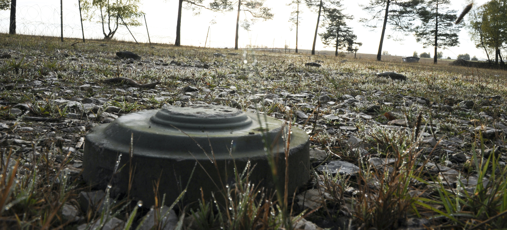

# CSCI 1302 - Minesweeper Alpha v2020.sp




This repository contains the skeleton code for the Minesweeper Alpha project
assigned to the students in the Spring 2020 CSCI 1302 classes
at the University of Georgia. 

### Minesweeper Overview

In your Minesweeper, the player is initially presented with a grid of
undifferentiated squares. Either some randomly-selected squares or seed-selected
squares (more on seeds later) are designated to contain mines. The
size of the grid and the number of mines are set in advance by a
seed file that the user specifies as a command-line argument to your
program. The ratio of the number of mines to the grid size is often used as a
measure of an individual game's difficulty. The grid size can also be
represented in terms of the number of rows and columns in the grid.
In this project description, we may refer to the _grid_ or to the
_minefield_. Both of these terms mean the same thing. Furthermore,
we will use the term _square_ to denote a location in the minefield, even
in situations where a location may be visually rectangular instead
of perfectly square.

The game is played in rounds. During each round, the player is presented with
the grid, the number of rounds completed so far, as well as a prompt. The player
has the option to do 5 different things, each of which is briefly listed
below and explained in great detail in later sections:

 1. Reveal a square on the grid.
 2. Mark a square as potentially containing a mine.
 3. Mark a square as definitely containing a mine.
 4. Lift the fog of war (cheat code).
 5. Display help information.
 6. Quit the game.

When the player reveals a square of the grid, different things can happen:

* If the revealed square contains a mine, then the player loses the game.

* If the revealed square does not contain a mine, then a digit is instead displayed
  in the square, indicating how many adjacent squares contain mines. Typically,
  there are 8 squares adjacent to any given square, unless the square lies on an
  edge or corner of the grid. The player uses this information to deduce the contents
  of other squares, and may perform any of the first three options in the list presented above.

* When the player marks a square as potentially containing a mine, a `?` is displayed
  in the square. This provides the user with a way to note those places that they
  believe may contain a mine but are not sure enough to mark as definitely containing
  a mine.

* When the player marks a square as definitely containing a mine, a flag, denoted
  by the character `F`, is displayed in the square.

To simplify the game mechanics, **the player may mark, guess, or reveal any square in the grid,
even squares that have already been marked or revealed.** For example, the player may issue a 
command to mark, guess, or reveal a square, regardless of its current state. The logic for 
determining what happens to the square is always the same. For example, if a square has been 
revealed and the user marks it as definitely containing a mine then a round is consumed and the
square should be marked. The user would then have to reveal this square again later. This may
not be consistent with how you've played Minesweeper in the past but it will make it easier
to code.

The game is won when **all** of the following conditions are met:

* All squares containing a mine are marked as _definitely_ containing a mine; and

* All squares not containing a mine are revealed.

At the end of the game, the player is presented with a score. Let `rows`, `cols`,
and  `rounds` denote the number of rows in the grid, columns in the grid, and
number of rounds completed, respectively. A round is defined as one successful
iteration of the main game loop. Therefore, only valid commands result in a round 
being consumed. To be clear, _rounds_ is not quite the same as the number of commands 
entered (some may be invalid); however, it should be less than or equal to that number.

The player's score is calculated as follows:

```java
score = 100.0 * rows * cols / rounds;
```

A score of `100` would denote a perfect game. In this version of Mineweeper, it should
not be possible for the player to win the game in less than `(rows * cols)`-many rounds.
Therefore, any game in which the player exceeds that many rounds would result in a score
that is less than `100`. When displaying the score, the number should always be printed
with two digits following the decimal point.


#### The User Interface

The possible commands that can be entered into the game's prompt as well as their
syntax are listed in the subsections below. Commands with leading or trailing
whitespace are to be interpreted as if there were no leading or trailing
whitespace. For example, the following two examples should be interpreted the
same:

```
minesweeper-alpha: help
minesweeper-alpha:         help
```

Although it's hard to see in the example above, trailing whitespace should
also be ignored. That is, if the user types ` ` one or more times before
pressing the `RET` (return) key, then those extra whitespaces should be
ignored.

The different parts of a command are known as tokens. The `help`
command, for example, only has one token. Other commands, such as the
`mark` (seen below) have more than one token because other
pieces of information are needed in order to interpret the command. As a quick
example (which will be explored in more depth below), the player can
mark the square at coordinate (0,0) using `mark` as follows:

```
minesweeper-alpha: mark 0 0
```

In the above example, you can see that the `mark` command has three
tokens. A command with more than one token is still considered syntactically
correct if there is more than one white space between tokens. For example, the
following four examples should be interpreted the same:

```
minesweeper-alpha: mark 0 0
minesweeper-alpha: mark     0  0
minesweeper-alpha:     mark 0 0
minesweeper-alpha:   mark     0  0
```

As a reminder, trailing whitespace is ignored.

#### Command Syntax Format

In the sections below, each command will the syntax format that it must adhere
to in order to be considered correct. Syntactically incorrect commands are
considered an error. Information about displaying errors to the player is
contained in a section below.

**Please do not confuse this syntax with regular expressions, a topic that
will not be covered in this course.** You are NOT meant to put this weird
looking syntax into any code. It is purely meant to convey to you, the reader,
what is and what is not valid input for a given command.

In a syntax format string, one or more white space is represented as a
`-`. Command tokens are enclosed in `[]` braces. If the
contents of a token are surrounded by `""` marks, then that token can
only take on that literal value. If more than one literal value is accepted for
a token, then the quoted literals are separated by `/`. If the
contents of a token are surrounded by `()` marks, then that token can
only take on a value of the type expressed in parentheses.

Syntax format strings are provided in this document in order to help you, the
student, understand how syntactically correct commands could potentially be
inputted by the player. These strings do not directly correspond to anything in
the Java programming language. You should be able to use the information
provided in these syntax format strings to parse commands entered by the
user.

#### Revealing a Square

In order to reveal a square, the `reveal` or `r` command
is used. The syntax format for this command is as follows: `-["reveal"/"r"]-[(int)]-[(int)]-`.
The second and third tokens indicate the row and column indices, respectively,
of the square to be revealed.

Let's go back to our `10`-by-`10` example. Suppose that we secretly know that there is
a mine in squares (1,1) and (1,3). Now suppose that the player wants to reveal
square (1, 2). Here is an example of what that might look like.


#### Guess Command

In order to mark a square as potentially containing a mine, the
`guess` or `g` command is used. The syntax format for this
command is as follows: `-["guess"/"g"]-[(int)]-[(int)]-`.
The second and third tokens indicate the row and column indices, respectively,
of the square to be revealed.

Let's go back to our `10`-by-`10` example. Suppose that the player wants to guess
square (1, 2). Here is an example of what that might look like.

minesweeper-alpha:
```

After the player correctly entered the command `g 1 2`, the state of
the game updates (e.g., number of rounds completed, the grid, etc.), and the
next round happens.

#### No Fog Command

This command removes, for the next round only, what is often
referred to as the, "fog of war." Squares containing mines, whether unrevealed,
marked, or guessed, will be displayed with less-than and greater-than symbols on
either side of the square's center (as apposed to white space). Using the
`nofog` command **does** use up a round.
In order to issue this command, the `nofog` command is used.
The syntax format for this
command is as follows: `-["nofog"]-`.

Let's go back to our `10`-by-`10` example. Suppose that we secretly know that there is
a mine in squares (1,1) and (1,3). If the player marked square (1,1) during the
first round and then used the `nofog` command during the second
round, then here is an example of what that scenario might look like:

#### Help Command

In order to show the help menu, the `help` or `h` command
is used. The syntax format for this command is as follows: `-["help"/"h"]-`.

Let's go back to our `10`-by-`10` example. Suppose that the player wants to display
the help menu. Here is an example of what that might look like.

minesweeper-alpha: h

Commands Available...
 - Reveal: r/reveal row col
 -   Mark: m/mark   row col
 -  Guess: g/guess  row col
 -   Help: h/help
 -   Quit: q/quit

minesweeper-alpha:
```

After the player correctly entered the command `h`, the state of
the game updates (e.g., number of rounds completed, the grid, etc.), the
help menu is displayed, and the next round happens.

#### Quit Command

In order to quit the game, the `quit` or `q` command
is used. The syntax format for this command is as follows: `-["quit"/"q"]-`.

Let's go back to our `10`-by-`10` example. Suppose that the player wants to quit the
game. Here is an example of what that might look like.

After the player correctly entered the command `q`, the game
displayed the goodbye message and the program exited gracefully.

#### Displaying Errors

If the number of rows and columns specified in a seed file is not in proper bounds,
then the following message should be displayed and the program should exit
using `System.exit(3)` (after the program terminates, a user should be able to confirm the 
exit status of `3` using `echo $?`.):

```

Seedfile Value Error: Cannot create a mine field with that many rows and/or columns!
```

Note that the first line is blank.

If a command entered by the player is incorrect or not recognized, then the following
message should be displayed to the player **and one round should be consumed**:

```

Input Error: Command not recognized!
```

Note that the first line is blank.

Let's go back to our `10`-by-`10` example. Suppose that the player either leaves the
prompt blank or enters in some command that is not recognized.
Here is an example of what that might look like.

<hr/>

[](http://creativecommons.org/licenses/by-nc-nd/4.0/)

<small>
Copyright &copy; Michael E. Cotterell and the University of Georgia.
This work is licensed under a <a rel="license" href="http://creativecommons.org/licenses/by-nc-nd/4.0/">Creative Commons Attribution-NonCommercial-NoDerivatives 4.0 International License</a> to students and the public.
The content and opinions expressed on this Web page do not necessarily reflect the views of nor are they endorsed by the University of Georgia or the University System of Georgia.
</small>
